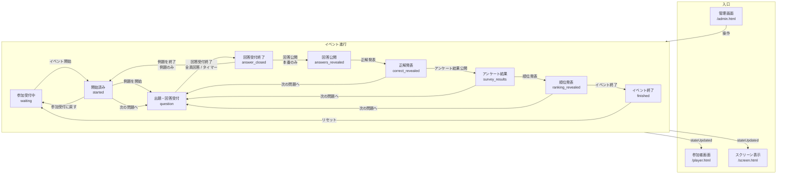

# リアルタイムクイズ

社内イベント向けのリアルタイムクイズアプリケーションです。  
参加者・スクリーン表示・管理画面を分けて、問題の出題から回答公開・順位発表まで進行できます。

## 機能概要

| 画面 | URL | 説明 |
|------|-----|------|
| トップ | `/` | 接続確認用の簡易画面 |
| 参加者 | `/player.html` | チーム参加・回答入力 |
| スクリーン表示 | `/screen.html` | 会場投影用の表示 |
| 管理画面 | `/admin.html` | 進行操作・参加コード設定（パスワード必須） |

主な流れは次のとおりです。

1. 管理者がパスワードでログインし、参加コードを設定する
2. 参加者がコード・チーム名・座席番号を入力して参加する
3. イベント開始 →（任意）例題で回答操作確認 → 例題終了
4. 本番：出題 → 回答受付終了 → 回答公開 → 正解発表 → アンケート結果公開 → 順位発表
5. 次の問題へ進む、またはイベント終了

例題は操作確認専用で、正解発表・採点は行いません。例題の文面は `data/questions.json` の `practice` で変更できます。

### 画面遷移

各 HTML は URL で直接開きます（画面間のリンクはありません）。  
参加者・スクリーン表示の見た目は、管理画面の操作で変わる共通ステータスに追従します。



| ステータス | 参加者画面 | スクリーン表示 |
|------------|------------|----------------|
| `waiting` | 参加フォーム / チーム情報 | 参加受付中 |
| `started` | 待機（出題待ち） | 待機 |
| `question` / `answer_closed` | 問題・回答 UI | 問題表示 |
| `answers_revealed` / `correct_revealed` | 結果（ゲージ・得点） | 結果表示 |
| `survey_results` | アンケート結果 | アンケート結果 |
| `ranking_revealed` | 順位 | 順位 |
| `finished` | 最終順位 | 終了＋最終順位 |

補足:

- **例題**（`question` → `answer_closed` → `started`）では回答公開以降のステップはありません
- **イベント終了**は、参加受付中・終了済み以外のほぼどの状態からも実行できます
- 管理画面はログイン後、現在のステータスに応じた操作ボタンだけが表示されます

### 管理画面パスワード

初期パスワードは `quiz-admin` です。  
変更する場合は `data/admin-config.json` を編集してください。

```json
{
  "adminPassword": "好きなパスワード"
}
```

変更後はサーバーを再起動してください。

## 必要環境

- Windows（この手順は Windows 向けです）
- Node.js（v18 以上を推奨）

## Node.js のインストール（ZIP をダウンロードする方法）

インストーラーを使わず、ZIP を展開して使う手順です。

### 1. ZIP をダウンロードする

1. 次のページを開く  
   [https://nodejs.org/dist/](https://nodejs.org/dist/)
2. 使うバージョンのフォルダを開く（例: `v22.17.0/`）
3. Windows 64bit 向けの ZIP をダウンロードする  
   例: `node-v22.17.0-win-x64.zip`

> LTS（推奨版）の番号が分からないときは、[https://nodejs.org/ja](https://nodejs.org/ja) で確認できます。

### 2. ZIP を展開する

1. ダウンロードした ZIP を右クリック → 「すべて展開」
2. わかりやすい場所に置く  
   例: `C:\tools\node-v22.17.0-win-x64`

展開後、次のようなファイルがあることを確認します。

- `node.exe`
- `npm.cmd`

### 3. コマンドで使えるようにする（PATH を通す）

PowerShell を開き、展開したフォルダのパスを PATH に追加します。  
（自分の展開先に合わせて書き換えてください）

**今開いている PowerShell のみ有効にする場合:**

```powershell
$env:Path = "C:\tools\node-v22.17.0-win-x64;" + $env:Path
```

**ユーザー環境変数に永続設定する場合:**

```powershell
[Environment]::SetEnvironmentVariable(
  "Path",
  "C:\tools\node-v22.17.0-win-x64;" + [Environment]::GetEnvironmentVariable("Path", "User"),
  "User"
)
```

永続設定した場合は、PowerShell を一度閉じて開き直してください。

### 4. インストール確認

```powershell
node -v
npm -v
```

バージョン番号が表示されれば準備完了です。

## ローカルで動かす方法

### 1. このリポジトリを用意する

すでにフォルダがある場合は、その場所へ移動します。

```powershell
cd C:\Users\あなたのユーザー名\work\quiz
```

Git で取得する場合の例:

```powershell
git clone https://github.com/kohei8787/quiz.git
cd quiz
```

### 2. 依存パッケージをインストールする

プロジェクト直下で次を実行します。

```powershell
npm install
```

`express` と `socket.io` などが `node_modules` に入ります。

### 3. サーバーを起動する

```powershell
npm start
```

起動に成功すると、次のようなメッセージが出ます。

```text
Server is running on http://localhost:3000
```

### 4. ブラウザで開く

| 画面 | アドレス |
|------|----------|
| 管理画面 | http://localhost:3000/admin.html |
| 参加者画面 | http://localhost:3000/player.html |
| スクリーン表示 | http://localhost:3000/screen.html |

止めるときは、サーバーを動かしている PowerShell で `Ctrl + C` を押します。

## 使い方（動作確認の流れ）

1. **管理画面** を開き、参加コードを設定する（「コードを設定」）
2. **参加者画面** を開き、参加コード・チーム名・座席番号を入力して参加する  
   （複数人分はブラウザの別タブ／別ウィンドウで確認できます）
3. **スクリーン表示** を開き、会場向けの表示を確認する
4. 管理画面で「イベント開始」→「次の問題へ」と進める
5. 回答後、「回答受付終了」→「回答公開」→「正解発表」→「アンケート結果公開」→「順位発表」の順で操作する

補足:

- 座席番号は管理画面の参加チーム一覧でのみ確認できます
- チーム情報（チーム名・座席番号）の変更は、イベント開始前のみ可能です
- 問題データは `data/questions.json` にあります

## フォルダ構成

```text
quiz/
├── server.js          # サーバー本体（Socket.io / Express）
├── package.json
├── data/
│   ├── questions.json # 問題データ
│   └── image/         # 画像（アンケート結果グラフなど）
└── public/
    ├── admin.html     # 管理画面
    ├── player.html    # 参加者画面
    ├── screen.html    # スクリーン表示
    ├── css/           # 画面ごとの CSS
    └── js/            # 画面ごとの JavaScript
```

## トラブルシューティング

### `node` や `npm` が認識されない

- ZIP を展開したフォルダのパスが PATH に入っているか確認してください
- PowerShell を開き直してから、もう一度 `node -v` を実行してください
- PATH を通さず使う場合は、フルパスでも実行できます  
  例: `C:\tools\node-v22.17.0-win-x64\node.exe server.js`

### `npm install` で失敗する

- インターネット接続を確認してください
- 会社 PC などでプロキシが必要な場合は、ネットワーク設定を確認してください

### ポート 3000 が使えない

ほかのアプリが `3000` を使っている可能性があります。  
その場合は、いったんそのアプリを終了するか、`server.js` の `PORT` を変更してください。

### 画面を更新しても古い動作のまま

ブラウザのキャッシュが残っていることがあります。  
ハードリロード（`Ctrl + F5`）を試してください。

## ライセンス

ISC
